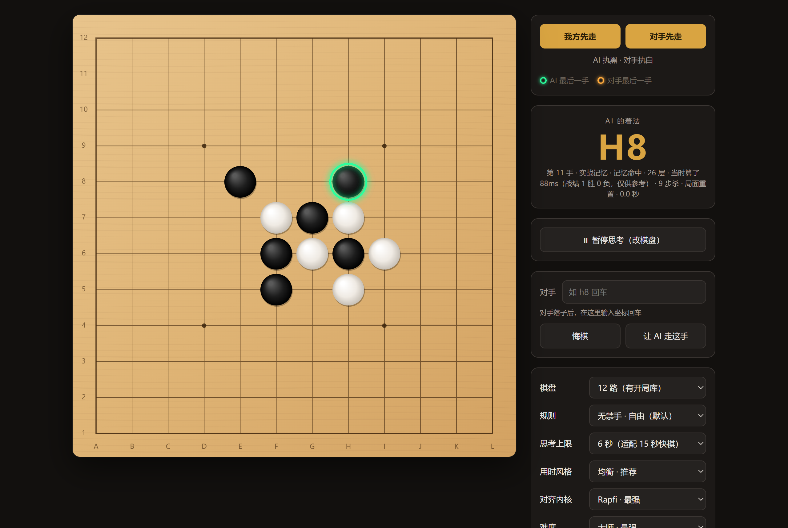
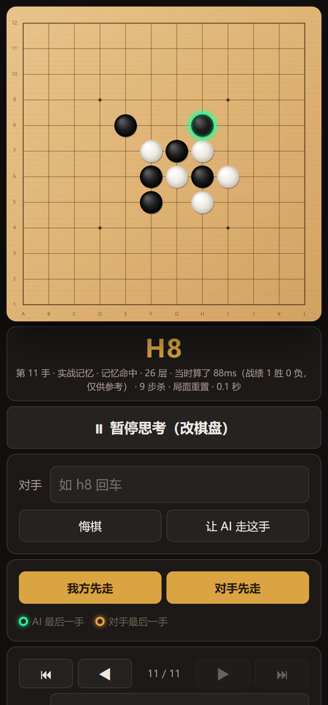

<div align="center">

# gomoku-harness

**让五子棋世界冠军引擎在快棋里发挥到上限的外层框架**

[](LICENSE)


⭐ **如果这个项目对你有帮助，请点一个 Star 支持一下！** ⭐

</div>

---

<p align="center">
  
  &nbsp;
  
</p>

## 这是什么

**gomoku-harness 不是一个新的五子棋引擎。**
搜索和估值交给 [Rapfi](https://github.com/dhbloo/rapfi) —— Gomocup（五子棋 AI 世界锦标赛）2025 年
自由规则 15 路、自由规则 20 路、标准规则、连珠、快棋**五个组别的冠军**。

我们做的是引擎**外面那一层**（harness）：开局库、实战记忆、对手回合的超前思考、用时控制、
绝境搏命、对局界面。目标只有一个 —— **把引擎的能力上限在真实对局里完整地发挥出来。**

### 为什么引擎需要一层 harness

竞赛引擎是按比赛规则打造的，而比赛规则有两条硬限制：

| 比赛规则 | 带来的问题 |
| --- | --- |
| **不许带开局库** | 每一手都从零开始算，开局就开始长考 |
| **不许在对手回合思考** | 对手想棋的十几秒里，CPU 全部闲着 |

真实对局没有这些限制。gomoku-harness 把两种时间分开用：

```
离线（不限时间）：Rapfi 在每个开局局面上算够久 → 最正确的一手 → 写进开局库
对局中（读秒）  ：开局库 / 实战记忆命中 → 0 秒出手
                 没命中 → Rapfi 现场计算，而且对手思考时我们已经在提前算了
```

引擎越强，离线灌进库里的着法就越正确 —— 开局库是一份会一直长大的资产。

## 实战成绩

> **测试条件：12 路棋盘 · 无禁手（自由规则） · 每手思考上限 6 秒**

- 进行了**数百局真人对局测试**。
- 唯一一次输棋是**执白**：人类对手通过复盘之前的对局，找到了那条线上的**唯一解**，才赢下这一局。
  （12 路无禁手下黑棋先行的优势非常大，白棋从第一手起就处在理论劣势。不计录入失误的对局。）
- **速度**：单日实战统计，**81% 的着法在 0.2 秒内给出**（开局库、实战记忆、瞬时战术直接命中）；
  需要现场计算的着法，用时中位数约 **1.6 秒**。

## 功能

| 功能 | 说明 |
| --- | --- |
| 🗂 **开局库** | 12 路 7000 多个局面由 Rapfi 离线深算出最佳着法，命中即 0 秒出手；15 路来自 Gomocup 世界赛与自对弈棋谱 |
| 🧠 **实战记忆** | 每一次搜索的结论都存下来，跨对局复用；同一局面有多个结论时，以分析最深的为准；输掉的对局会在电脑空闲时自动深算复查 |
| ⏩ **超前思考** | 对手思考时，预测他最可能走的几手，并提前把我们的应手算好 |
| ⏱ **自适应用时** | 简单局面秒答，复杂局面才长考；每手有硬上限，服务器无响应时自动兜底，不会超时 |
| 🎯 **绝境搏命** | 局面被证明必输时，挑一手让对手最难走对的防守，把翻盘的机会留给对手的失误 |
| 🎲 **对称随机** | 局面对称时，在严格等价的几手里随机选一手（比如 12 路开局的中间 4 点），不被摸清套路，棋力零损失 |
| 🔬 **12 路 NNUE** | Rapfi 官方权重覆盖 13~22 路；本项目为 12 路打了权重补丁，12 路同样启用神经网络估值（实测 +35 Elo） |
| 📜 **多规则** | 无禁手 / 标准（恰好五子）/ 连珠（有禁手） |
| 📱 **手机可用** | 电脑运行服务，手机浏览器打开就能下，界面针对手机做了排版 |
| 📝 **对局日志** | 每一手的来源、搜索深度、用时都记下来，方便复盘 |
| 🛟 **离线兜底** | 没有 Rapfi 时自动切换到自带的 JS 引擎，直接双击网页也能玩 |

## 快速开始

### 需要什么

- **Windows 10 / 11（64 位）**
- **[Node.js](https://nodejs.org) 16 或更新版本**
- 推荐 **8 核以上** CPU、4 GB 以上空闲内存（默认同时运行 3 个引擎进程，见下方「高级设置」）

Rapfi 引擎已经包含在仓库里，不需要另外下载。

### 启动

1. 下载本项目：点击页面上方绿色的 **Code → Download ZIP** 并解压，或者

   ```bash
   git clone https://github.com/Qyyer233/gomoku-harness.git
   ```

2. 双击根目录的 **`启动五子棋.bat`**。
3. 窗口里会打出两个地址：
   - 在这台电脑上下棋：打开 `http://localhost:8080/`
   - 在手机上下棋：打开窗口里显示的局域网地址（手机要和电脑连同一个网络）

> 服务器运行期间，电脑保持唤醒、屏幕常亮，确保引擎全速运行、不被系统节能打断；
> 关掉服务器窗口即恢复原有的电源设置。

## 怎么下

| 操作 | 方法 |
| --- | --- |
| 开新局 | **我方先走**：AI 执黑，立刻落下第一手 · **对手先走**：AI 执白，等对手落子 |
| 对手落子 | 直接点棋盘，或在「对手」输入框里输入坐标（如 `h8`）回车 |
| 看 AI 的应手 | 大字显示在棋盘旁边，下面一行说明它从哪来（开局库 / 实战记忆 / 搜索多少层 / 用了多久） |
| 改棋盘 | 点 **暂停思考**：这时悔棋、摆子、前后翻看都不会触发引擎；再点一次恢复 |
| 复盘 | `⏮ ◀ ▶ ⏭` 或键盘 `←` `→` `Home` `End`；在中途落子等于从这里改走别的 |
| 接着下一盘已有的棋 | 在「导入」里粘贴整局棋谱（如 `H8 I9 J10 …`） |
| 摆一个残局 | **自定义摆局**：清盘后点哪落哪，摆好后选 AI 走哪一方 |

### 设置说明

| 设置 | 说明 |
| --- | --- |
| 棋盘 | 12 ~ 22 路。12 路和 15 路带开局库 |
| 规则 | 无禁手（默认）/ 标准 / 连珠。开局库只用于无禁手 |
| 思考上限 | 每手最多想多久。**15 秒读秒建议 6 秒**，给自己留出操作时间 |
| 用时风格 | 快（简单局面秒答）/ 均衡（推荐）/ 充分（每手都想满） |
| 超前思考强度 | 对手回合预先备好几手（1 / 3 / 5 / 7） |
| 绝境搏命 | 必输局面下挑最难被走对的防守（建议开启） |
| 对弈内核 | Rapfi（最强）/ 自研 JS 引擎（对照、离线用） |

## 工作原理

每一手按下面的顺序决定，能查到就不算，能证明就不估：

```
① 瞬时战术   我方能成五 / 必须挡对方的四             0 秒
② 开局库     Rapfi 离线深算过的局面                   0 秒
③ 实战记忆   历次对局中算过的局面（取分析最深的结论） 0 秒
④ 超前思考   对手思考时提前算好的应手                  0 秒
⑤ 现场搜索   Rapfi 在思考上限内计算，自适应收手
      └─ 若被证明必输 → 绝境搏命：选一手对手最难走对的防守
⑥ 局面对称时，在严格等价的着法里随机选一手
```

算力分配（默认，按 24 线程的机器）：主引擎 8 线程负责出手，另外 2 个各 8 线程的引擎在对手回合做超前思考。
实测线程收益在 12 线程左右就基本饱和，富余的核拿去做超前思考更划算。

## 高级设置

启动前设置环境变量即可调整（不设就用默认值）：

| 变量 | 默认 | 作用 |
| --- | --- | --- |
| `RAPFI_THREADS` | min(8, CPU 核数) | 主引擎线程数 |
| `RAPFI_PREP_ENGINES` | 2 | 超前思考引擎个数，设 `0` 关闭超前思考 |
| `RAPFI_PREP_THREADS` | 同主引擎 | 每个超前思考引擎的线程数 |
| `RAPFI_MATCH_SPREAD` | 21 | 自适应用时的强度，越小越倾向于早出手 |
| `RAPFI_MEMO` | 开 | 设 `0` 关闭实战记忆 |
| `RAPFI_REVIEW` | 开 | 设 `0` 关闭空闲时的输棋复查 |
| `RAPFI_REVIEW_MS` | 30000 | 复查时每个局面算多久（毫秒） |
| `RAPFI_SWINDLE` | 开 | 设 `0` 关闭绝境搏命 |

总线程数（主引擎 + 超前思考）不要超过 CPU 的逻辑核数，否则会互相抢。CPU 核数较少时，
建议把 `RAPFI_PREP_THREADS` 调小，或设 `RAPFI_PREP_ENGINES=0`。

## 常见问题

**只能在 Windows 上用吗？**
仓库里带的是 Rapfi 的 Windows 版。其他系统需要自行编译 Rapfi（[源码](https://github.com/dhbloo/rapfi)），本项目未在其他系统上测试。

**直接双击 `index.html` 能用吗？**
能，但只能用自带的 JS 引擎（浏览器不允许网页直接启动 Rapfi），棋力会明显下降。请用 `启动五子棋.bat`。

**服务器窗口里为什么不能拖选文字？**
为了保证服务器不会被意外暂停，启动时关闭了控制台的「快速编辑」模式（这个模式下点击窗口会暂停程序）。
需要复制窗口里的文字时，右键标题栏 → 编辑 → 标记。

**开局库和实战记忆存在哪？**
开局库在 `data/book12.json`、`data/book.json`；实战记忆在 `data/memo.json`，会随着你下棋不断增长。

## 开发

```bash
npm start       # 启动服务器（不带防熄屏，长时间使用请用 启动五子棋.bat）
npm test        # 全部自检
npm run logs    # 查看对局日志统计
```

- Rapfi 组件的版本、来源与修改说明：[engines/rapfi/README.md](engines/rapfi/README.md)
- `tools/` 下是离线工具：造开局库、强度对比（SPRT）、基准测试、复盘分析等

## 致谢

- [Rapfi](https://github.com/dhbloo/rapfi) —— Haobin Duan（dhbloo）及贡献者。本项目的全部棋力来自这个引擎。
- [rapfi-networks](https://github.com/dhbloo/rapfi-networks) —— Rapfi 的 NNUE 权重（CC0）。
- [Gomocup](https://gomocup.org) —— 公开的历届五子棋 AI 世界锦标赛对局。

## 许可证

本项目以 [GNU GPL v3.0](LICENSE) 发布。
仓库中附带的 Rapfi 引擎同样以 GPL v3.0 授权，版本、源码地址与修改说明见 [engines/rapfi/README.md](engines/rapfi/README.md)。

---

<div align="center">

⭐ 觉得有用的话，欢迎点个 Star —— 这是对项目最大的鼓励。

</div>
